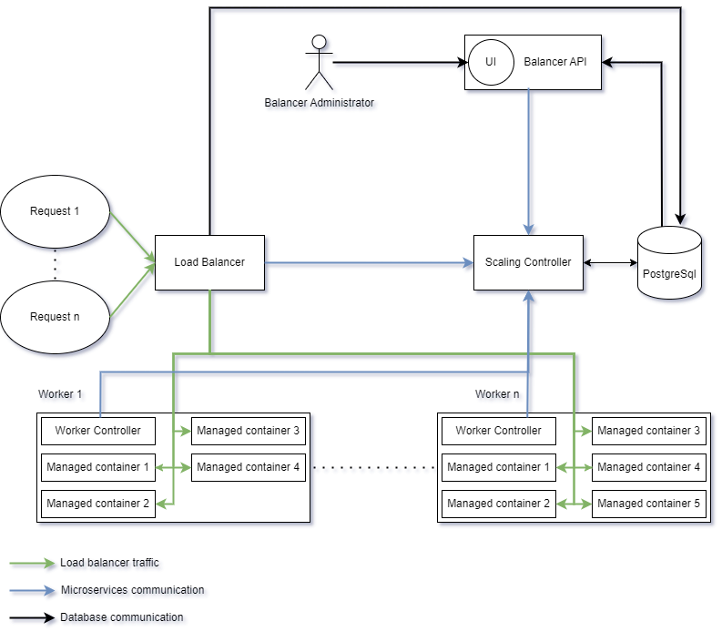
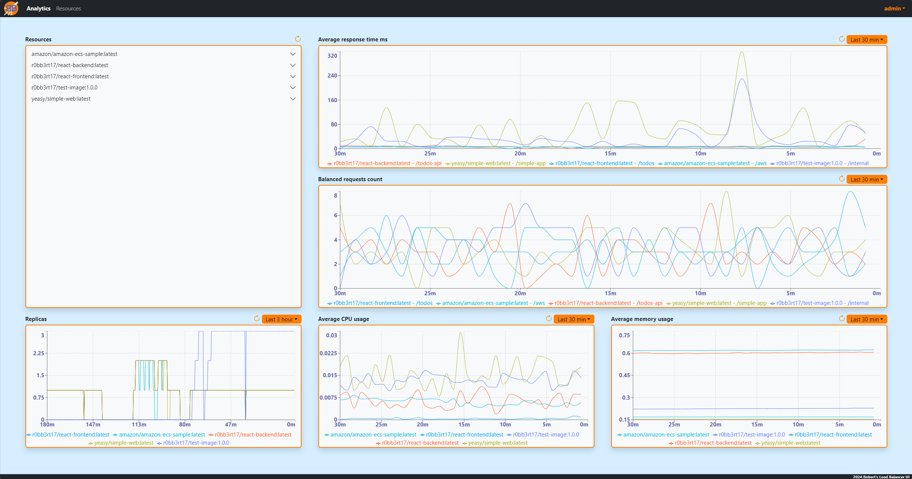
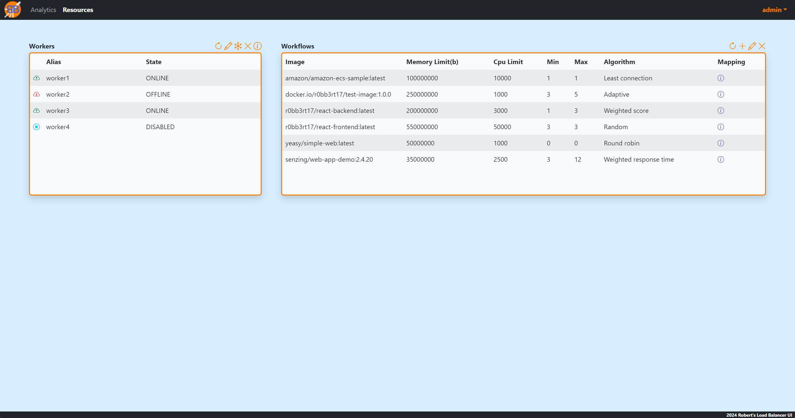

# Load Balancer

Implements a containerized load balancer and scaling mechanism using a microservice based architecture:
.

## Microservices

- **Load balancer** - redirects the incoming requests to the matching Docker Container selected using the 
configured algorithm for that specific set of containers.

- **Scaling controller** - collects the utilization level of the managed systems containers and creates scaling
requests based on the utilization level and the systems scaling limits.

- **Worker controller** - sends the utilization levels of the managed containers to the *Scaling controller* and
reads the scaling requests assign to that specific Virtual machine.

- **Balancer api** - exposed the overall system utilization metrics and enables the administrator to alter the
configuration of the existent managed system, configure a new system to be managed or analyze the utilization
level of the existing system.

### Administrator interface

#### Login page

#### Analytics page

#### Resources page


## Deployment
The system can be deployed using the docker-composed.yaml files which can be configured using the ```.env```:
- On master: [docker-composed.yaml](./docker/master/docker-compose.yaml)
- On each worker: [docker-composed.yaml](./docker/worker/docker-compose.yaml)
